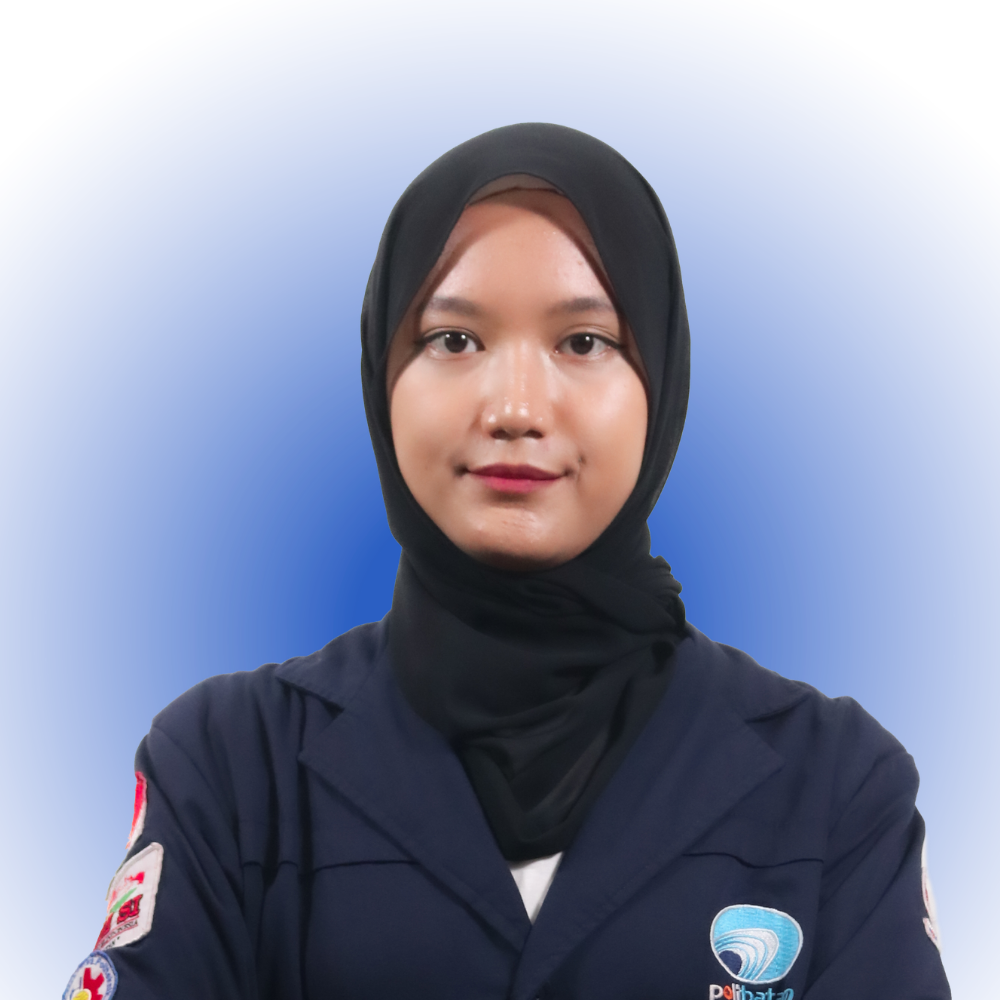

  

I love exploring design and frontend development to create interactive websites that combine **creativity**, **functionality**, and meaningful **user experiences**.

 

---

### ABOUT ME

<table>
<tr>
<td width="180" valign="top">

</td>
<td valign="top">

<b>Passionate about clean, purposeful design</b>

I enjoy exploring design and web development to create clean, responsive, and user-friendly digital experiences.

As an Informatics student at <b>Politeknik Negeri Batam</b>, I combine creativity and functionality to build meaningful digital products.

</td>
</tr>
</table>

<table align="center" width="700">
<tr>
<td align="center" width="233">
<b>3.91</b> 
GPA
</td>
<td align="center" width="233">
<b>6+</b> 
Technologies
</td>
<td align="center" width="233">
<b>2</b> 
Organizations
</td>
</tr>
</table>

---

### TECH STACK

Technologies and tools I use for building digital experiences.

  

---

### SKILLS

<H5>What I bring to the table.</H5>

#### Hard Skills

<table width="700">
<tr>
<td width="350">
<b>Responsive Web Design</b> 
█████████░ &nbsp; 88%
</td>

<td width="350">
<b>Frontend Development</b> 
████████░░ &nbsp; 85%
</td>
</tr>

<tr>
<td>
<b>UI/UX Design</b> 
████████░░ &nbsp; 80%
</td>

<td>
<b>Version Control</b> 
████████░░ &nbsp; 75%
</td>
</tr>

<tr>
<td>
<b>Database Management</b> 
███████░░░ &nbsp; 72%
</td>

<td>
<b>Backend Development</b> 
███████░░░ &nbsp; 70%
</td>
</tr>
</table>

#### Soft Skills 

             

---

## LET'S BUILD SOMETHING MEANINGFUL

I'm open to collaboration, new opportunities, and creative projects related to **web development, frontend design, backend, and UI/UX**.

 

  

### nelifauziyah.my.id

**Web Developer & UI/UX Enthusiast**

© 2026 Neli Fauziyah
Designed & built with passion.

